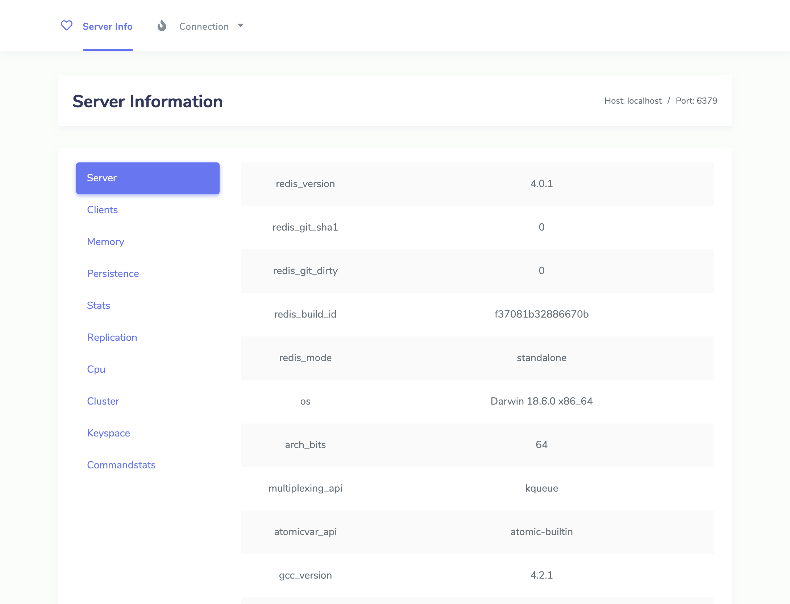
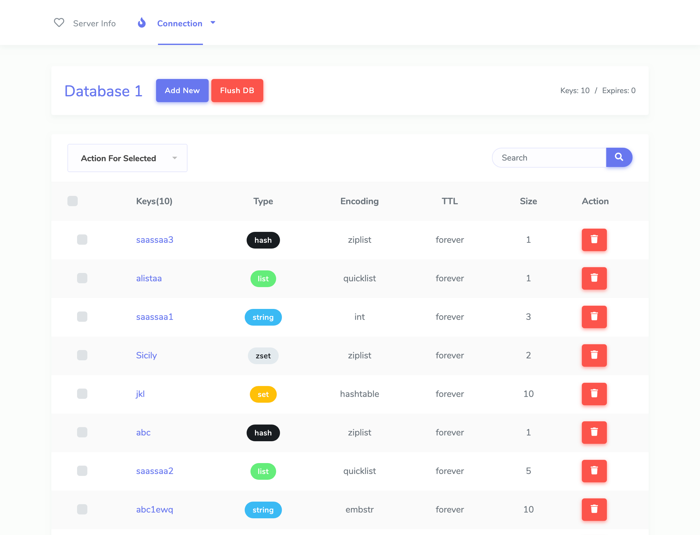
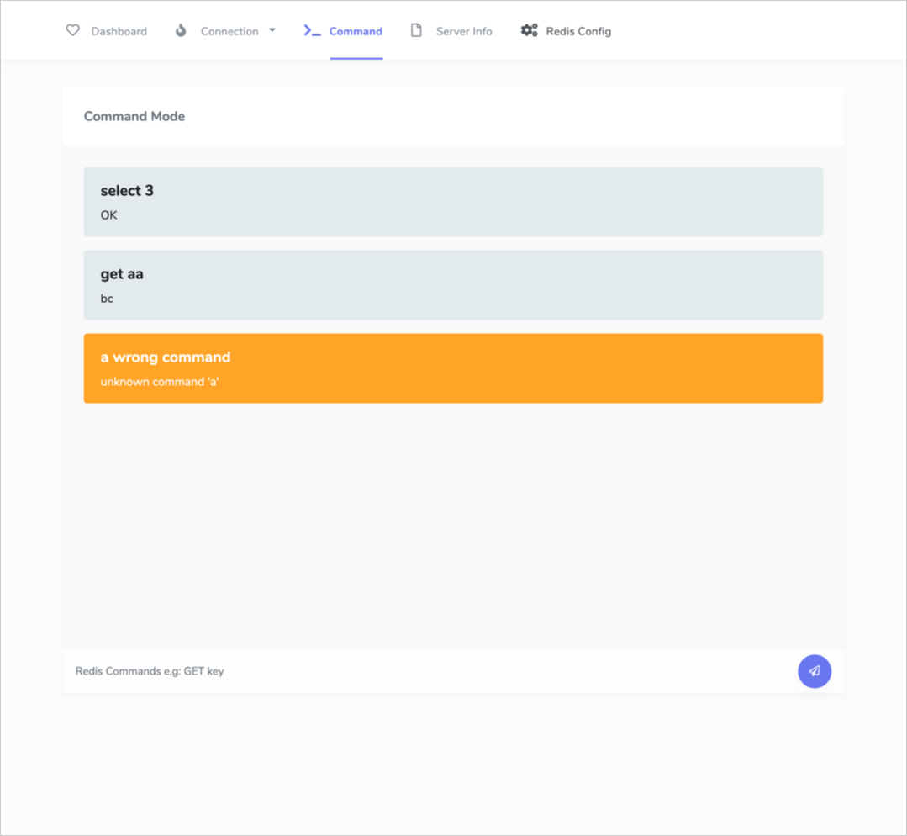
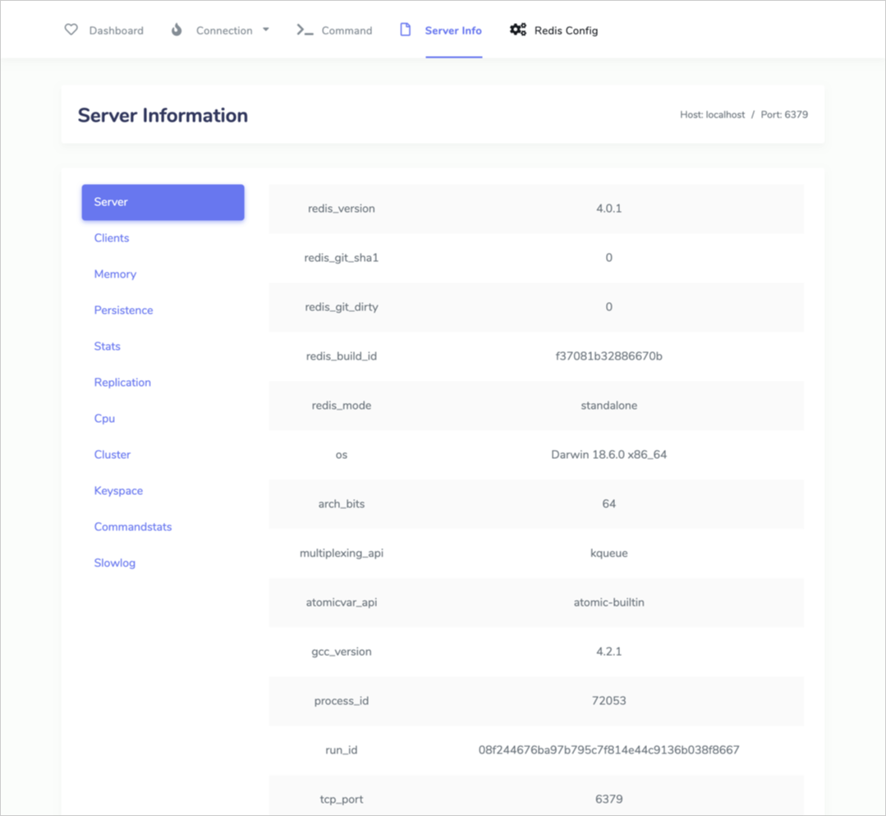

# flask-redisboard

A flask extension to support user view and manage redis with beautiful interface.


## Get Started

Installation is easy:
```
$ pip install flask-redisboard
```

Initialize the extension:
```
from flask_redisboard import RedisBoardExtension
...
board = RedisBoardExtension(app)
```

Also support for factory pattern:
```
from flask_redisboard import RedisBoardExtension
board = RedisBoardExtension()

def create_app():
    app = Flask(__name__)
    ...
    board.init_app(app)
```

Now, you can go to 127.0.0.1:5000/redisboard 


## Preview









## Todo
- [x] Command mode
- [x] Dashboard
- [x] Config edit and view
- [x] Slowlog
- [x] Add a key
- [x] Zset CRUD
- [ ] Validate empty input in frontend
- [ ] some submit need success msg
- [x] scroll to next page, not click a button
- [x] better keyspace and cmdstats view for server info 
- [ ] can add multi values for hash/zset/list etc.
- [ ] unittest
- [ ] documents
- [x] package and upload
- [ ] merge js and css
- [ ] clients list and manage